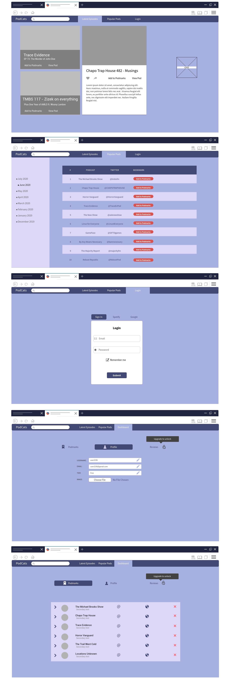
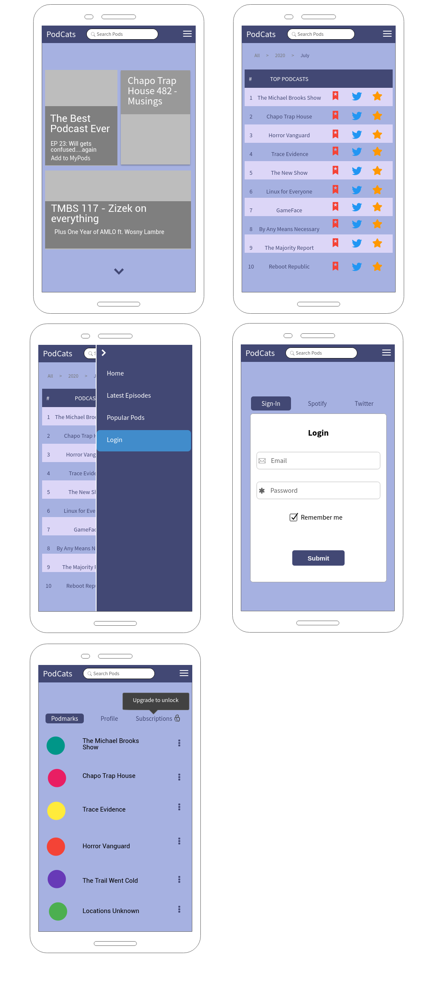
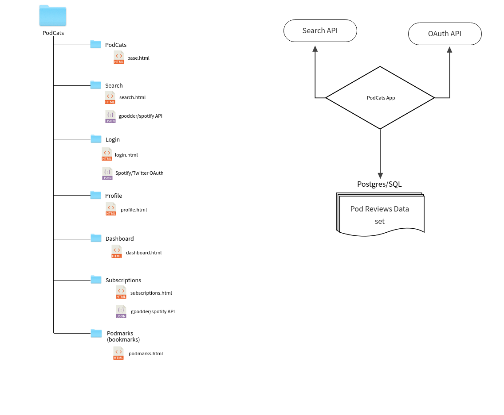

# Code Institute Milestone 4 - Full Stack Frameworks with Django

## Podcat(s)

### Project Description/Goals
Podcat(s) The Podcast Catalogue(s) is a Podcast review platform where user can search for, add, review, and import podcasts from iTunes.

Podcat(s) is deployed to Heroku from the master branch and will automatically update to reflect any new changes pushed.

You can view the deployed site on [Heroku](https://podcats.herokuapp.com/)

### Technologies used
- [Python](https://www.python.org/)
- [Django](https://www.djangoproject.com/)
- [HTML](https://www.w3schools.com/html/), [CSS](https://www.w3schools.com/Css/), [JavaScript](https://en.wikipedia.org/wiki/JavaScript)
- [Bootstrap](https://getbootstrap.com/)
- [Google Fonts](https://fonts.google.com/)
- [Font Awesome](https://fontawesome.com/)
- [Material Icons](https://material.io/resources/icons/?style=baseline)
- [iTunes API](https://affiliate.itunes.apple.com/resources/documentation/itunes-store-web-service-search-api/)

 
## UX

### User Stories
| AS A                                              | I WANT                                                 | SO THAT                                 |
| ----------------------------------------------------- | ------------------------------------------------------- | ------------------------------------------ |
| Podcast consumer     | a way to search for podcasts by genre     | I can discover new podcasts |
| Podcast consumer     | the ability to pay to unlock additional features    | I can get extra features |
| Podcast consumer | to read reviews of podcasts | I can find out if a podcast is worth my attention |
| Podcast consumer | to write reviews for podcasts I've listened to| I can help others find out if podcasts are worth listening to|
| Podcast consumer| a way to easily add or import missing podcasts| I can make sure my favourite pods are included|

### Strategy
The idea here was to primarily be a place users could look up information and reviews about podcasts. A "Rotten Tomatoes or IMDb" but for podcasts. 

1.) Searching: when I use IMDb or RottenTomatoes it's mainly to just navigate to the site and search; no logging in etc. So that was the first must have for me, the ability to search from the main navigation without authentication.
2.) Reading Reviews: the next use case for me is looking at reviews. Like the above I wanted the ability to read reviews to not be locked behind authentication.
3.) Writing Reviews: At this point I think if the user is invested enough in the site/service that they want to contribute reviews, authentication is a fair expectation. So at this stage users need to register or login via google/twitter.
4.) Adding Podcasts: At this stage I'm starting to cater to more serious users of the app as they're not just adding to existing data here they're looking to insert missing data (in the form of absent podcasts)
5.) Cost: As a proponent of FOSS (Free & Open Source Software) I wanted to make monetary interaction with the site relatively minimal. I settled on "Lifetime" memberships as that's something I myself have purchased in the past and presents a unique value proposition rather trying to convince users to subscribe to yet another service.
6.) Super Users/Admin Functions: Obviously a podcast database isn't worth much if it doesn't have podcast data so I wanted to provide a simple way for "superusers" or admins to mass upload data.

### Scope
Initially I wanted to have multiple APIs linked in so that the app could look for podcasts on various platforms. However, some early teething problems on that front caused me to scale back and instead add just one API which would serve as a fallback should the podcast being searched for not be present (and to allow easy import of said missing podcast). The API chosen for this was iTunes API as it fit the bill and was surprisingly easy to get set-up.

### Skeleton
#### Wireframes

### Surface
For the look of the site I wanted muted/pastel purples or blues. I decided on [this pallete](https://coolors.co/edafb8-feffea-3c91e6-ff8600-424874) from coolors.co as it provided the muted purple/blue colour but also some brighter colours to use for buttons etc. The layout was to be built around a robust main nav with integrated search box. The podcast and reviews would be displayed in bootstrap cards with images where appropriate.

### Current Features
- Search box that returns results from the DB or iTunes if none are found in the db.
- If search results are found in the DB there is also an option underneath to search iTunes anyway in case said results don't contain what the user is looking for.
- The podcast detail page shows any reviews that have added for the podcast in question and displays a star rating.
- Adding reviews can be done by clicking the RATE buttong and adding a title, content body, and selecting a rating out of 5.
- If the user adding the review has already reviewed the podcast in question they will instead be shown their existing review which they can update or delete.
- Pro Upgrade for users who want the ability to add, edit, and delete podcasts from the database.
- Adding podcasts can be done manually but typing in the necessary info or by search iTunes and importing the podcast info from there.
- User dashboard where users can edit their profile and see reviews they've posted.
- Latest Reviews section that displays several of the most recently posted reviews & info about the podcasts they relate to.
- Top Podcasts section that shows the "Most Review" podcasts.

### Future Features
- User playlists where users can curate lists of their favourite podcasts.
- Advanced search that can be used to search by category, genre etc.
- Podcast Recommendations.
- Share podcast/review to social media.

## Deployment
### Instructions for running locally
This app shows it's powere when there is lots of data being used. As such I recommend running it locally rather than demoing on Heroku due to the limitation on rows in Heroku's Postgres.
To make a local copy of the repo on your machine:

- Create a folder in the desired location on your computer.
- Open a terminal ([Mac instructions](https://macpaw.com/how-to/use-terminal-on-mac)|[Windows instructions](https://www.quora.com/How-do-I-open-terminal-in-windows)|[Linux instructions](https://www.howtogeek.com/howto/22283/four-ways-to-get-instant-access-to-a-terminal-in-linux/))
- Navigate to the folder you created using `cd` command in terminal (e.g. `cd ~/Documents/Podcats`)
- Type `git init`
- Next type `git clone https://github.com/nealbrophy/CI_M4_Podcats`
- To break the link between your local copy and the repo at https://github.com/nealbrophy/CI_M4_Podcats type `git remote rm origin`

### To run locally
#### requirements
In order to run the app locally you'll need:
- 1.) Stripe a/c (once you obtain API keys you can save them in your settings file if you DON'T plan on pushing to Git. If you want to push to git it is HIGHLY recommended that you save your various SECRET KEYS in a git-ignored file).
- 2.) A google developer a/c
- 3.) A twitter developer a/c
- 4.) Python 3.6 or later and pip package manager (I recommend [using pipenv to create a virtual environment](https://www.youtube.com/watch?v=6Qmnh5C4Pmo) before completing the `pip install` steps below)
- 5.) To declare some environment variables
- 6.) A code editor (I recommend PyCharm Pro, it has a generous free trial)
- 7.) Install the requirements (pip3 install -r requirements.txt)

Example using PyCharm Pro or Community Edition:
- After you've git cloned as outlined above.
- Open PyCharm and click "Open Project" and select the Podcats folder.
- Before install requirements etc you''ll want to set-up a virtual environment. PyCharm makes this easy:
    - Click the area at the bottom right where it says "Python 3.8 (no interpreter)" or perhaps just "No interpreter"
    - Click "Add interpreter"
    - Choose "New Environment" and just stick with the PyCharm defaults
    - Create accounts for or login to the following services and obtain API keys
        - https://console.developers.google.com/
        - https://developer.twitter.com/en/portal/projects-and-apps
        - https://stripe.com/ie
    - Create a file called env.py and at the top of it type:
        `import os`
    - Add your various API keys to it as follows:
        - `os.environ.["STRIPE_PUBLIC_KEY"] = "your stripe public key"`
        - `os.environ.["STRIPE_SECRET_KEY"] = "your stripe secret key"`
        - `os.environ.["GOOGLE_OAUTH_ID"] = "your google oauth id"`
        - `os.environ.["GOOGLE_OAUTH_SECRET"] = "your google oauth secret"`
        - `os.environ.["TWITTER_KEY"] = "your twitter API key"`
        - `os.environ.["TWITTER_SECRET"] = "your twitter secret"`
    - Once you have those added you can try running the app with:
        `python3 manage.py runserver`
    - If it runs ok you'll want to run the pending migrations with:
        `python3 manage.py migrate`
    - Next, create a super user for yourself:
        `python3 manage.py createsuperuser`
    - You can now start adding data to the app either by uploading via the provided CSV functionality, importing from iTunes, or manually adding.

### Instructions for deploying to Heroku
If you would like to deploy your version to heroku you can follow the steps below:
- Create a [Heroku](https://www.heroku.com/) account
- Click `New` and `Create New App`
- Give your app a name and choose a region and click `Create App`
- Go to `Settings` and click `Reveal Config Vars`
- You should now add config vars here to match those created [above](#Environment-Variables) in your local env.py file. The finished result should look like this:

- In your text-editor/IDE type:
 - `echo web: python app.py > Procfile`
- Go to the `Deploy` section on your heroku project and follow the instructions to push your app to the heroku git

## Testing
### Unit Tests
N/A

### Manual Tests
The app went through rigorous manual testing as follows:

#### Adding Data
- Uploading podcast data from CSV in files ranging from a few hundred rows to >100,000
- Uploading review data from CSV as above
- Deleting above data and re-uploading
- Uploading with missing/incorrect info

#### Relationships
Since the app relies on relationships between categories, podcasts, reviews, and users these relationships were tested with the following datasets:
- [iTunes podcasts](https://www.kaggle.com/roman6335/13000-itunes-podcasts-april-2018) by roman6335
- [All Podcast Episodes published in Dec 2018](https://www.kaggle.com/listennotes/all-podcast-episodes-published-in-december-2017) by Listen Notes
- [Podcast Reviews](https://www.kaggle.com/thoughtvector/podcastreviews) by Thought Vector
- [Podcasts-Data](https://github.com/odenizgiz/Podcasts-Data) by odenizgiz
- [all-podcasts-dataset](https://github.com/ageitgey/all-podcasts-dataset) by ageitgey

## Validation

### Python validation
All Python code was validated using PyCharm Professional's built-in validation as well as intermittent validation against the [PEP8 online checker](http://pep8online.com/)

### HTML validation
All pages validated using [W3C Markup Validation Service](https://validator.w3.org/)
### CSS validation
Style sheets validated using [W3C CSS Validation Service](https://jigsaw.w3.org/css-validator/validator)
### JS validation

## Bugs

### Squashed bugs

### Open bugs

## Credits/Acknowledgements
- upload functions based on [this medium post](https://medium.com/@simathapa111/how-to-upload-a-csv-file-in-django-3a0d6295f624) by [Seema Thapa](https://medium.com/@simathapa111)
- Multiple tutorials & How-Tos from the excellent [SimpleIsBetterThanComplex](https://simpleisbetterthancomplex.com/) by Vitor Freitas.
- Pagination with help from:
    - [this StackOverflow question](https://stackoverflow.com/questions/2266554/paginating-the-results-of-a-django-forms-post-request)
    - [this CodeLoop.org tutorial](https://codeloop.org/django-pagination-complete-example/)
    - [this tutorial](https://samulinatri.com/blog/django-pagination-tutorial/) by Samuli Natri
    - [this answer](https://stackoverflow.com/a/30864681) from [Blackeagle52](https://stackoverflow.com/users/2798610/blackeagle52) on StackOverflow
- Login modal with help from [this answer](https://stackoverflow.com/questions/39197723/how-to-move-singup-signin-templates-into-dropdown-menu/39235634#39235634) on StackOverflow
- Changed Review.podcast_id from (very slow) choices to raw id field with help from [this answer](https://stackoverflow.com/questions/980405/raw-id-fields-for-modelforms) on StackOverflow
- Stripe implementation from [Code Institute's Boutique Ado](https://github.com/ckz8780/boutique_ado_v1) project